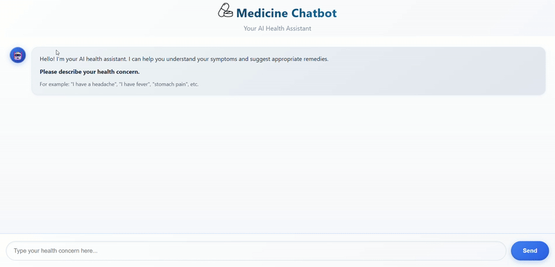

# Health Assistance Chatbot



## Description

The **Health Assistance Chatbot** is an AI-driven tool that helps users by asking three targeted questions based on the health issue they enter.  
After collecting responses, the chatbot provides:

- Medicine recommendation  
- Prescription-style instructions  
- Basic guidance based on the symptoms  

This project demonstrates how NLP and rule-based logic can create practical health-support tools.

## Features

- Symptom understanding using simple NLP  
- Dynamic, condition-based follow-up questions  
- Medicine and prescription generation  
- Clean conversation flow  
- Lightweight and easy to deploy

## Tech Stack

- Python  
- NLP (Custom rule-based logic / ML optional)  
- Flask / Streamlit / FastAPI (use whichever your project uses)  
- HTML / CSS / JavaScript (if UI included)


## Installation

```bash
git clone https://github.com/deept-369/Medicine-Chatbot.git
cd health-chatbot
pip install -r requirements.txt
python app.py


